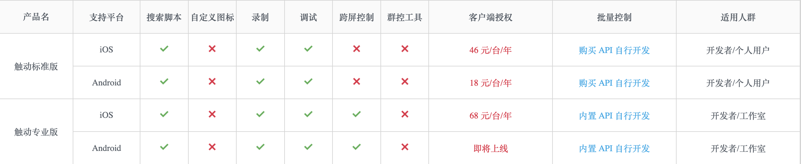
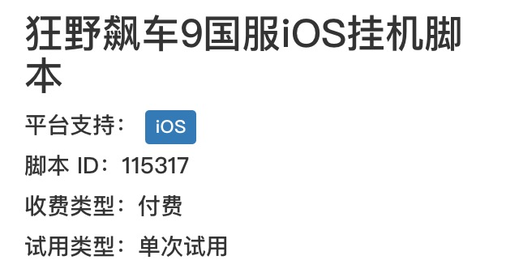
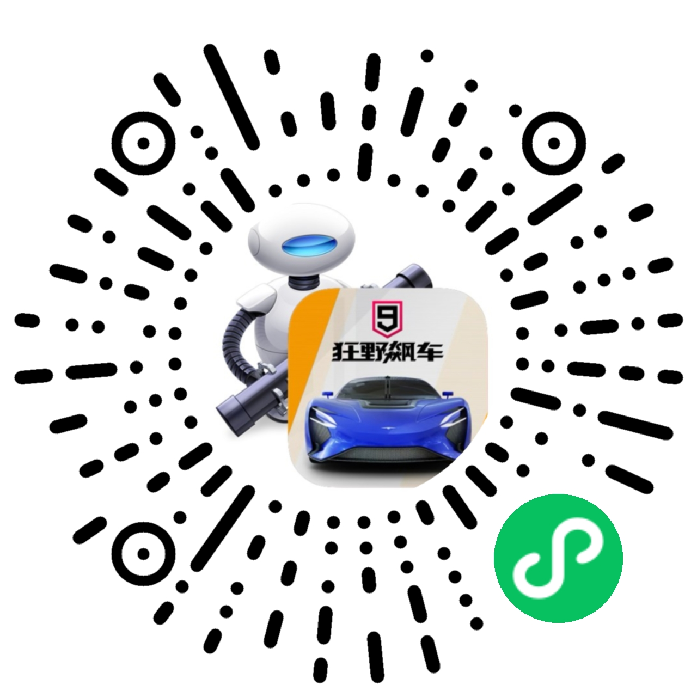

# 狂野飙车9 iOS国服脚本使用方法

[TOC]

## 须知

+ **没有安卓版！没有安卓版！没有安卓版！安卓版使用脚本会进小黑屋，严重者会直接封号！**
+ **脚本不是外挂！脚本不是外挂！脚本不是外挂！本群不提供外挂！**
+ **iOS设备必须越狱！**
+ **没有国际版！**

- 本脚本目前适用设备为**iPhone 5S/SE/6/6s/7/8/iPod Touch5G(6G)**，**iPad与Plus设备均不支持**。

+ 脚本不是免费的，初次使用可以免费试用三天。试用过期后需要联系群主购买激活码，**价格月卡7元，季卡18元**。
+ 本脚本依赖触动精灵客户端，脚本支持标准版或专业版，不支持企业版和小精灵。触动精灵也不是免费的，每天可以免费试用1小时，购买触动精灵授权码请在自己设备上操作。购买触动精灵授权码与开发者无关，相关售后请联系触动精灵官方客服。
+ **需要特别注意：**iOS12 及其以上系统无法使用标准版，需要安装专业版 arm64 版本并且购买专业版授权码。下图为产品对比图：



+ 脚本ID为**115317**，开发者为**ffffff**，请认准脚本ID和开发者名称！
+ 因为生涯刷金币有上限，大约30局后收益将为原十分之一，所以没有开发赛事刷金币功能，如果需要刷金币请使用多人刷声望功能。
+ 开发者不提供设备越狱和触动精灵客户端安装服务，相关操作请自行百度。
+ 请先确保设备能够运行狂野飙车9国服游戏本身！

## 脚本搜索与使用

+ 在设备上安装触动精灵后，在搜索栏中搜索**狂野飙车9国服iOS挂机脚本**即可下载试用。
+ **首次运行该脚本前需要在更多-文件管理-插件下载ts.so插件！否则会报错！**



+ **在使用刷赛事功能时，先用需要用的车手动完成一局。**之后游戏会自动定位到此车，只需在脚本开始之初设置中间上还是中间下即可。如果被寻车辆已满星，每次进入车库不会定位到上局使用车辆，需要开启寻车返回选项。
+ **需手动开启自动驾驶功能。**
+ **需要过多久返回赛事模式或寻车模式（分钟）必须填写大于0的数字，否则会报错。**

## 脚本介绍

+ **多人刷声望，自动补充多人包**。

+ **多人刷包**，刷完之后会自动停止脚本，可配合触动精灵客户端提供的脚本定时启动功能使用。

+ **刷赛事**，可选使用一辆车或一列车，即使被寻车满星也不会影响脚本运行。

+ **账号被顶后**可按照脚本设定在一定时间后返回游戏。

+ 能够把当日运行**日志**于次日首次运行脚本时**发送到指定邮箱**。

+ 可以选择当段位为传奇段位时是否刷多人声望。

+ 刷多人时可选择**跳过某车辆供刷赛事时使用**。

+ 寻车时，被寻车辆满星的话进入车库不会跳到上局使用车辆，可以开启选车后返回车库在选车解决此问题。

+ 脚本出错时会**自动重启游戏重置脚本**。

+ **节能模式**，可使设备在最低功耗下运行游戏。

+ 可自动输入密码登陆（考虑到信任问题，此功能未开放，可联系开发者免费开放）。

+ 赛事没油看广告：建议配合VideoAdsSpeed开20倍使用。

+ **远程日志功能**，可以访问网址

  ```
  https://yourdomin.cn/api/a9log?udid=YYY（YYY为你设备的udid）
  ```

  查看本日脚本日志，远程监控脚本运行情况。

在这里可以查看自己设备的UDID：http://www.pgyer.com/tools/udid

+ **远程控制功能**，可以访问网址

```
https://yourdomin.cn/api/a9control?command=XXX&udid=YYY
```

来远程控制脚本的运行。YYY需要更改为你设备的udid，XXX有如下几种选项

| XXX  | 含义                                                 |
| ---- | ---------------------------------------------------- |
| 0    | 暂停脚本运行，与XXX=1配合使用                        |
| 1    | 恢复脚本运行，与XXX=0配合使用                        |
| 2    | 将主模式更改为多人刷积分声望                         |
| 3    | 将主模式更改为赛事模式，所刷赛事和所用车辆需提前设置 |
| 4    | 终止脚本运行，此操作不可逆                           |
| 5    | 赛事没油没票后改为等待60分钟                         |
| 6    | 赛事没油没票后改为去刷多人                           |
| 7    | 将主模式更改为多人刷包                               |

> 如果你使用恢复脚本运行功能，即使检测到顶号，也不会再等待，而是立刻重新登录进入游戏。

## 小程序控制脚本运行

在微信搜索**狂飙脚本助手**或扫描下方二维码进入小程序。



进入小程序后输入设备UDID即可查看当前脚本设置，并可以直接修改生效。

### 截图


## 附录

+ 脚本运行之后可以在触动精灵客户端**更多-文件管理-资源**中看到名为**A9Info.txt**和**A9log.txt**两个文件，**A9Info.txt**记录了日期和日期当天脚本所运行的多人和赛事局数，请勿修改或删除此文件。**A9log.txt**是记录的是当日脚本运行记录，此记录会在每天脚本首次运行时被发送到指定邮箱后清空，请勿修改或删除此文件。
+ 如果出现脚本不停地识别画面，请**耐心等待几分钟**，脚本运行超时会重启游戏。
+ 如果你愿意帮助开发者适配更多的iOS/iPadOS设备，可以联系开发者，适配成功后免费赠送3个月脚本使用权。
+ 账号因此被封者，概不负责。
+ **有问题请联系开发者。**

## 开发者联系方式

+ QQ群：**1028746490**，可联系群主和管理员。
+ 邮箱：yourqq@qq.com